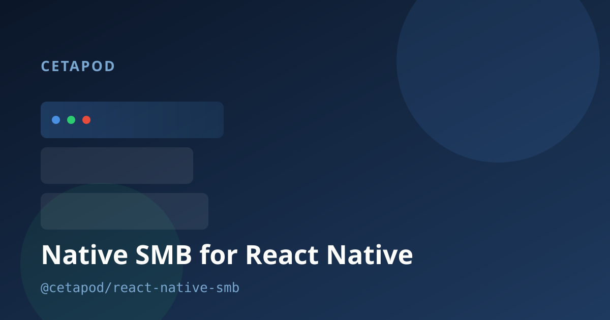

# @cetapod/react-native-smb



[](https://cetapod.github.io/react-native-smb/)
[](https://cetapod.github.io/react-native-smb/docs/)

SMB client for React Native via [libsmb2](https://github.com/sahlberg/libsmb2) and [Nitro Modules](https://nitro.margelo.com).

## Features

- SMBv2/v3
- `SmbTask` per operation — `result()`, `subscribe()`, `cancel()`
- 4-slot connection pool, interactive-priority slot 0
- 8-chunk pipelining per connection
- `SmbError` / `SmbTaskError`, React hooks

## Compatibility

|                            |                |
| -------------------------- | -------------- |
| React Native               | >= 0.76        |
| React                      | >= 19          |
| react-native-nitro-modules | >= 0.22, < 1.0 |
| iOS                        | 12+            |
| Android                    | not yet        |

## Install

```bash
npm install @cetapod/react-native-smb react-native-nitro-modules
cd ios && pod install
```

## Quick start

```typescript
import { SMB, type SmbCredentials } from '@cetapod/react-native-smb';

const smb = SMB();
const creds: SmbCredentials = { username: 'user', password: 'pass' };

await smb.connect('smb://192.168.1.100/Media', creds).result();
const entries = await smb.listDirectory('/', false).result();

const task = smb.downloadFile('/video.mp4', '/local/video.mp4');
task.subscribe((snap) => console.log(snap.progress));
await task.result();
```

Connection URLs are `smb://<host>[:<port>]` for `initialize`, and
`smb://<host>[:<port>]/<share>` for `connect`. Pass username and password in
`SmbCredentials`; pass directory and file paths to filesystem methods.

## Documentation

|                                           |                                                   |
| ----------------------------------------- | ------------------------------------------------- |
| [Task model](./docs/TASK_MODEL.md)        | Subscribe, fire-and-forget, transfer tray, errors |
| [API reference](./docs/API.md)            | Methods, types, hooks, utilities                  |
| [Connection pool](./docs/ARCHITECTURE.md) | Slots, chunk pipeline, multichannel               |
| [Example app](./example/README.md)        | Running the Expo demo                             |

## Example app

```bash
npm run example
```

See [example/README.md](./example/README.md).

## License

LGPL-2.1 — same family as libsmb2. See [LICENSE](./LICENSE).
